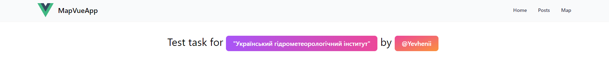
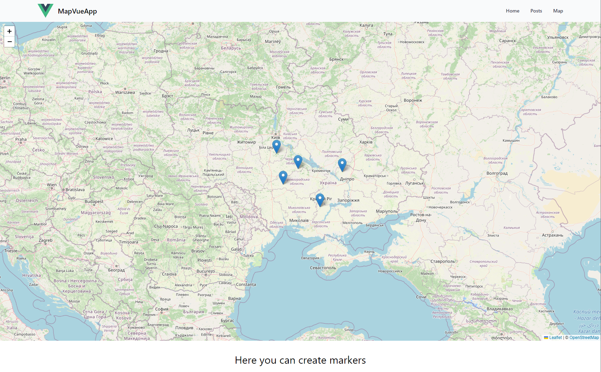

# map-vue-app

**Publish:** https://evheniq.github.io/map-vue-app/

**Preview:**


**Start project:**
```
git clone https://github.com/Evheniq/map-vue-app/
cd map-vue-app
npm install
npm run dev
```

**Map:**


**Solved:**
- [x] responsive SPA
- [x] posts page
- [x] map page
- [x] page navigation
- [x] build charts
- [x] build map
- [x] save markers to localstore
- [x] and other features

**Using:**
- Tailwind
- Vite
- chartjs
- leaflet
- router
- axios

**Problems:**
- In the project, I can do better separation of display and business logic.
- Eslint has incorrect configuration.
